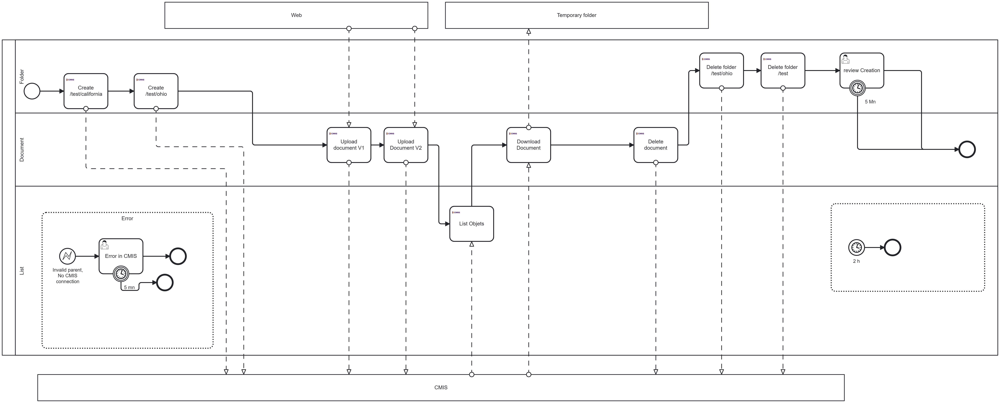

# camunda-8-connector-cmis

Connector to execution operations on a CMIS (Content Management Interoperability Service) repository




CMIS stand for Content Management Interoperability Services. This protocol is used by different product (Alfresco, Documentum) to store document.

The connector has different function:
* Create folder
* Upload a document from a FileStorage or a Camunda Document to the CMIS system
* Download a document from CMIS to a FileStorage or a Camunda Document
* Delete folder
* Delete document


# Start a CMIS docker
See [lightCMISServer/README.md](lightCMISserver/README.md)

# Connect

Use a JSON connection. For example

```json
{
  "url":"http://localhost:8099/cmis/browser",
  "userName":"test",
  "password":"test"}
```

# Principle


# Function available in the connector

# Developpement

## Start localy the connector

Execute the class [LocalConnectorRuntime.java](src/test/java/io/camunda/csv/LocalConnectorRuntime.java). 
It starts a local connector, using the [application.yaml](src/test/resources/application.yaml) file to connect to the Zeebe server.

BPMN test is available [CmisConnection.bpmn](src/test/resources/CmisConnection.bpmn). THis process download a file from internet (this GitHub repository) and saves it in the local CMIS server

The connection to the CMIS server is 
```json
{"url":"http://localhost:8099/cmis/browser","userName":"test","password":"test"}
```
This Cmis can be starts locally using the [lightCMISserver README.md](lightCMISserver/README.md)

## Generate Element Template
Execute the class [ElementTemplateGenerator.java](src/test/java/io/camunda/csv/ElementTemplateGenerator.java) to generate the Element template.

The connector uses the Cherry generator to create a rich element template. 

## Generate documentation
Execute the class [DocumentationGenerator.java](src/test/java/io/camunda/csv/DocumentationGenerator.java) to generate the documentation to describe each function.

The connector uses the Cherry principle to create this documentation.