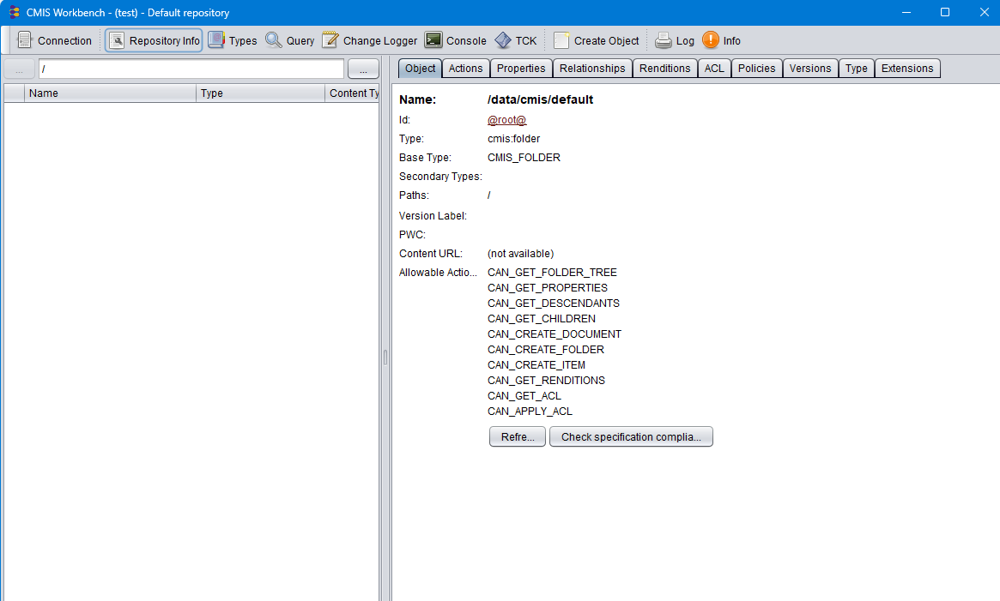

# Light CMIS Server

# Introduction
This server is started in a docker image.
The soyurce is available here
https://hub.docker.com/r/exoplatform/lightweightcmisserver

# pull the image

Execute
```shell
docker pull exoplatform/lightweightcmisserver
```

# start the image

execute
```shell
docker-compose -f lightCMIS-docker-compose.yaml up -d
```

# Use a workbench to access the server

Download the workbench tool http://chemistry.apache.org/java/developing/tools/dev-tools-workbench.html

Connect with

````
URL : http://localhost:8099/cmis/browser
Binding : Browser
Username : test
Password : test
Authentication : Standard
Compression : On
Client Compression : Off
Cookies : On
````

You access the 

